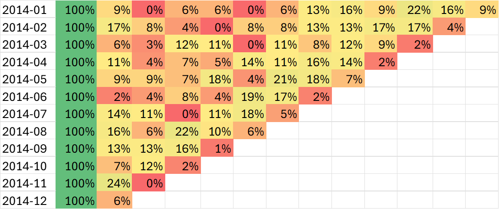
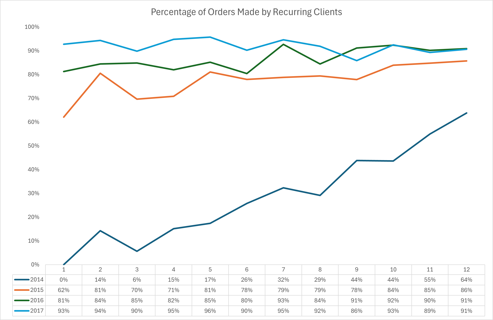
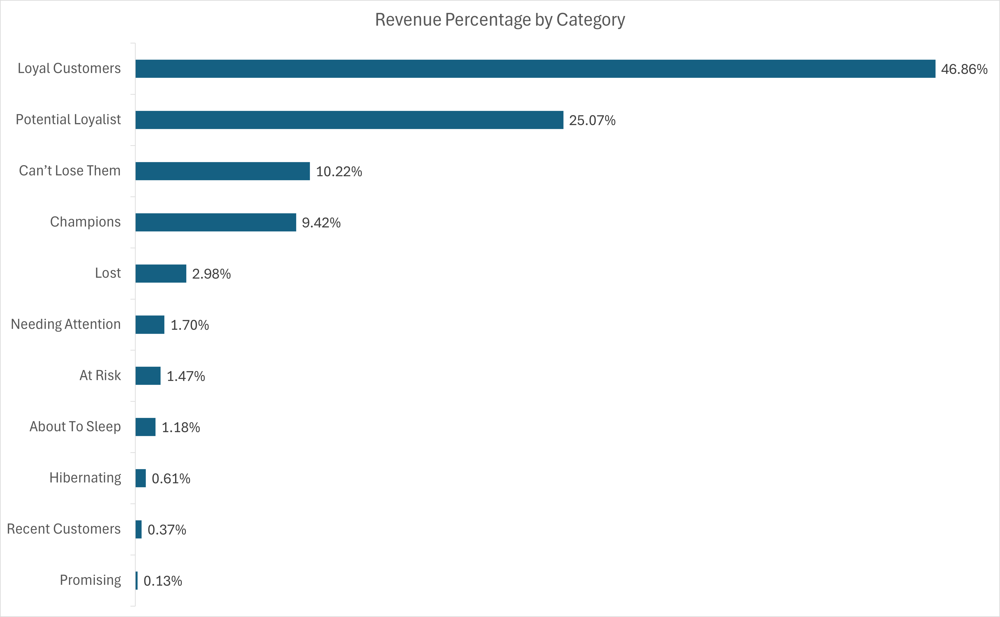
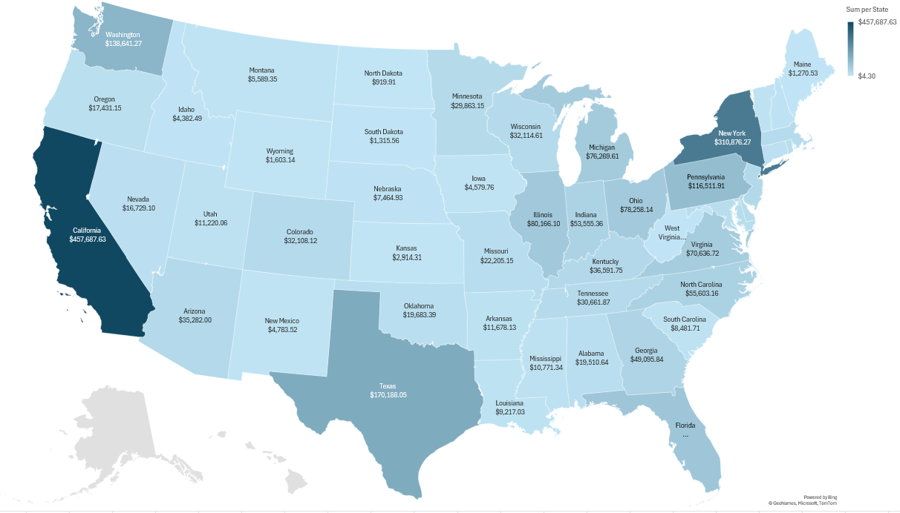
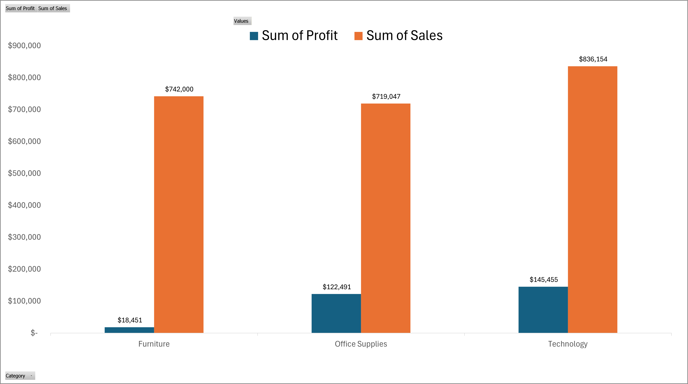

# SuperStore
# SuperStore Customer & Sales Analysis

## Table of Contents
- [Project Background](#project-background)
- [Data Structure & ERD](#data-structure--erd)
- [Executive Summary](#executive-summary)
- [Insights Deep-Dive](#insights-deep-dive)
  - [Cohort Analysis](#cohort-analysis)
  - [RFM Analysis](#rfm-analysis)
  - [Store & Product Rank](#store--product-rank)
- [Recommendations](#recommendations)
- [Assumptions & Caveats](#assumptions--caveats)

---

## Project Background

SuperStore is a multi-location retailer chain operating across several physical stores in the US, offering a wide range consumer goods. Founded with a focus on accessible retail, the company serves a diverse customer base and competes primarily on product variety, store availability, and customer loyalty.

Despite having access to transactional data, SuperStore's management team had historically relied on isolated spreadsheets to track performance. This project represents an end-to-end analysis of SuperStore's order data from **2014 to 2017**, answering the core business questions: 
- **How quickly do new customers disengage?**
- **Which customers are most valuable, and which are at risk of churning?**
- **Which stores and products drive the most revenue?**

Insights and recommendations are provided across three key areas:

- **Cohort Analysis:** Evaluation of customer retention patterns over time, grouped by the month of first purchase.
- **RFM Analysis:** Segmentation of customers by Recency, Frequency, and Monetary value to identify Champions, Loyal Customers, At-Risk groups, and Lost customers.
- **Store & Product Rank:** Assessment of which store locations and product categories drive the most revenue and order volume.

The Excel workbook containing all analyses and visualizations can be downloaded **[here](#)** *(replace with your file link)*.

---

## Data Structure & ERD

SuperStore's database consists of four tables with a total of approximately **10.000 records** spanning 2014–2017.

| Table | Description |
|---|---|
| `orders.csv` | All purchase orders placed across store locations within the analysis period |
| `customers.csv` | Customer profiles across all stores in the network |
| `products.csv` | Attributes of products sold across stores (category, name, price) |
| `location.csv` | Store location data where purchases were made |

---

## Executive Summary

Between 2014 and 2017, SuperStore processed approximately **10.000 orders** across its store network. The RFM segmentation revealed that SuperStore has great growth potential with 40% of their customers being classified as Potential Loyalist. Cohort retention data shows that first-month drop-off is steep across all acquisition cohorts, with only a fraction of customers returning. On the product side, **Technology products** consistently leads in both revenue and profit, while the **Furniture** category has a very low profit margin.

---

## Insights Deep-Dive

### Cohort Analysis

- **Retention drops sharply after the first month.** Across all acquisition cohorts from 2014–2017, average Month 1 retention sits at approximately **6%**. This pattern is consistent regardless of the cohort's acquisition period. Revealing that the store is not leveraging seasonal purchases mainly in December during the holiday season.
- A closer look to the Cohort data also reveals that SuperStore has not been able to consistenly acquire new clients resulting in over 90% of the sales of 2017 being made by recurring clients.  

---

### RFM Analysis

RFM scores were calculated by ranking each customer on three dimensions: **Recency** (days since last purchase), **Frequency** (total number of orders), and **Monetary Value** (total spend). Customers were then grouped into segments based on combined score thresholds. The reference used to determine the segments can be found here: https://www.putler.com/rfm-analysis/.

| Customer Segment | Description | Actionable Tip |
|---|---|---|
| **Champions** | Bought recently, buy often, and spend the most | Reward them. Great candidates for early product launches and brand promotion |
| **Loyal Customers** | Spend consistently and respond well to promotions | Upsell higher-value products. Ask for reviews. Keep them engaged |
| **Potential Loyalists** | Recent customers who bought more than once and spent a decent amount | Offer a loyalty program or membership. Recommend complementary products |
| **Recent Customers** | Bought most recently but not frequently | Provide onboarding support and start building the relationship early |
| **Promising** | Recent shoppers who haven't spent much yet | Build brand awareness and offer free trials or introductory deals |
| **Needing Attention** | Above-average R, F, and M values but haven't purchased very recently | Use limited-time offers. Reactivate with recommendations based on past purchases |
| **About To Sleep** | Below-average recency, frequency, and monetary values — at risk of going cold | Share valuable content, recommend popular products, and reconnect with discounts |
| **At Risk** | Spent big and bought often, but haven't returned in a long time | Send personalized re-engagement emails. Offer renewals and helpful resources |
| **Can't Lose Them** | Made the largest purchases frequently, but haven't returned in a long time | Win back with renewals or new products. Don't let them go to competitors |
| **Hibernating** | Last purchase was long ago, low spend, and low order count | Offer relevant products and special discounts. Recreate brand value |
| **Lost** | Lowest scores across recency, frequency, and monetary value | Attempt a reach-out campaign. If no response, deprioritize to save resources |

Key findings:

- **Loyal Customers account for approximately 47% of total revenue** despite representing only 27% of the customer base. This segment is the primary revenue engine and warrant proactive retention efforts.
- **Potential Loyalist segment contains 40% of all customers**, this represents a great opportunity for the store to increase their revenue if they are able to turn them into loyal customers.
- **8% of customers fall into the Can't Lose Them segment**, being the third revenue stream representing over 10%. 
- **Recent customers represent only 2% of all customers** - there is clar potential to increase the number of new customers.

---

### Store & Product Rank

- **Stores in California leads in total revenue**, generating almost **20%** of the revenue. Which is aligned with the population size, being the most populated State in the US.
- **Stores in Florida underperforms significantly**, given it is the third most populated State and account for less than 4% of total revenue. 
- **Technology products** are the highest-grossing category, contributing **36% of total revenue and over 50% of total profit**. 
- **Furniture sales** generates 32% of total revenue but **only around 6% of total profit**, with some products even having negative profit margins.

---

## Recommendations

### Customer Retention (Marketing & CRM Team)
- **Invest in converting Potential Loyalists.** This segment already exhibits positive purchase behavior and represent 40% of total customers. A loyalty incentive, such as a points multiplier or a threshold discount on their next order, could accelerate their progression to the Loyal Customer segment. This progression could contribute significantly to the financial health of the SuperStore.
- **Protect Can't Lose Them customers with exclusive benefits.** This group accounts for 10% of total revenue representing the third most important segment in that metric. Early access to new products or dedicated service can reduce the risk of losing them to competitors.

### Store Operations (Regional Management Team)
- **Investigate the underperforming stores in Florida**. A qualitative review of their product assortment, staffing, and local demographics relative to top-performing locations may reveal correctable gaps.

### Product & Merchandising (Category Management Team)
- **Review the Furniture product categories**. Furniture products generally occupy significant square footage of a store and with low, sometimes even negative, profit margins the Furniture products need a new source. Considering it still generates over 30% of total revenue it is still worth the effort to keep it in store instead of eliminating it completely.
- **Double down on the Technology category** by ensuring consistent availability and exploring adjacent upsell opportunities (e.g., providing repair services, extended guarantee or bundling products that are commonly bought together).

---

## Assumptions & Caveats

- **Cohort assignment is based on first order date.** Customers are assigned to the cohort of their earliest recorded purchase. 
- **RFM thresholds are relative, not absolute.** Segment boundaries were defined using quantile-based scoring within this dataset. 
- **"Monetary" in RFM reflects total revenue, not profit.** 
