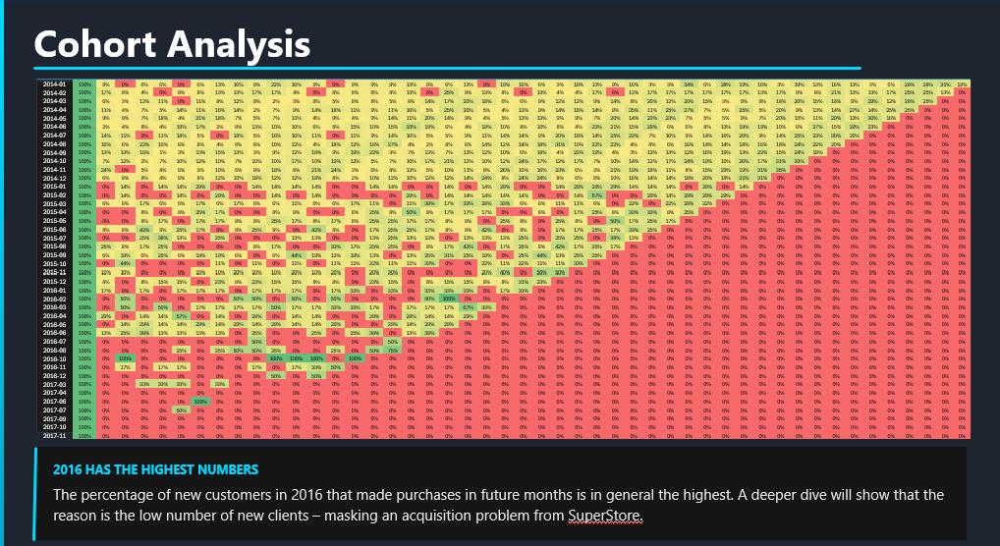
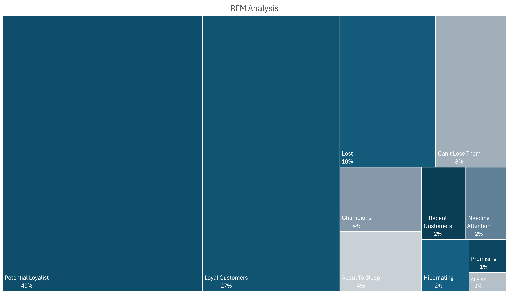

# SuperStore
# SuperStore Customer & Sales Analysis

## Table of Contents
- [Project Background](#project-background)
- [Data Structure & ERD](#data-structure--erd)
- [Executive Summary](#executive-summary)
- [Insights Deep-Dive](#insights-deep-dive)
  - [Cohort Analysis](#cohort-analysis)
  - [RFM Analysis](#rfm-analysis)
  - [Store & Product Rank](#store--product-rank)
- [Recommendations](#recommendations)
- [Assumptions & Caveats](#assumptions--caveats)

---

## Project Background

SuperStore is a multi-location supermarket chain operating across several physical stores, offering a wide range of food and consumer goods. Founded with a focus on accessible retail, the company serves a diverse customer base and competes primarily on product variety, store availability, and customer loyalty.

Despite having access to transactional data, SuperStore's management team had historically relied on isolated spreadsheets to track performance — with no unified view across stores, products, or customer segments. A data team was assembled to change that. This project represents an end-to-end analysis of SuperStore's order data from **2014 to 2017**, answering the core business question: **which customers are most valuable, and which are at risk of churning?**

Insights and recommendations are provided across three key areas:

- **Cohort Analysis:** Evaluation of customer retention patterns over time, grouped by the month of first purchase.
- **RFM Analysis:** Segmentation of customers by Recency, Frequency, and Monetary value to identify Champions, Loyal Customers, At-Risk groups, and Lost customers.
- **Store & Product Rank:** Assessment of which store locations and product categories drive the most revenue and order volume.

The Excel workbook containing all analyses and visualizations can be downloaded **[here](#)** *(replace with your file link)*.

---

## Data Structure & ERD

SuperStore's database consists of four tables with a total of approximately **[X,XXX] records** spanning 2014–2017.

| Table | Description |
|---|---|
| `orders.csv` | All purchase orders placed across store locations within the analysis period |
| `customers.csv` | Customer profiles across all stores in the network |
| `products.csv` | Attributes of products sold across stores (category, name, price) |
| `location.csv` | Store location data where purchases were made |

*(Insert ERD image here — recommended tool: [dbdiagram.io](https://dbdiagram.io))*





Prior to analysis, data quality checks were performed to identify nulls, duplicate order IDs, and referential integrity between tables. *(Link to data quality notes or Python/SQL script if applicable.)*

---

## Executive Summary

Between 2014 and 2017, SuperStore processed approximately **[X,XXX] orders** across its store network. The RFM segmentation revealed that a small portion of customers — Champions and Loyal Customers — drive a disproportionate share of revenue, while a significant segment of one-time or lapsed buyers represents a material churn risk. Cohort retention data shows that first-month drop-off is steep across all acquisition cohorts, with only a fraction of customers returning beyond Month 3. On the product side, **[Top Category]** consistently leads in both order volume and revenue, while certain store locations significantly outperform others in customer lifetime value.

*(Insert overview dashboard screenshot here)*

```

```

---

## Insights Deep-Dive

### Cohort Analysis

- **Retention drops sharply after the first month.** Across all acquisition cohorts from 2014–2017, average Month 1 retention sits at approximately **[X%]**, declining to **[X%]** by Month 3. This pattern is consistent regardless of the cohort's acquisition period.
- **The [Year] cohort shows the strongest long-term retention**, maintaining **[X%]** retention at Month 6 — roughly **[X]pp above** the cohort average. This may be tied to [seasonal promotions / store expansion / product launches] in that period.
- **No cohort fully recovers after a drop.** Once customers lapse beyond Month 4, re-engagement is rare, suggesting the window for retention intervention is narrow.
- **[Most recent cohort]** is too early to draw long-term conclusions, but its early retention curve is [tracking above / below] prior cohorts.

*(Insert cohort heatmap here)*

```

```

---

### RFM Analysis

RFM scores were calculated by ranking each customer on three dimensions: **Recency** (days since last purchase), **Frequency** (total number of orders), and **Monetary Value** (total spend). Customers were then grouped into segments based on combined score thresholds.

| Segment | Description |
|---|---|
| **Champions** | Bought recently, buy often, and spend the most |
| **Loyal Customers** | Regular buyers with strong monetary value |
| **Potential Loyalists** | Recent customers with average frequency |
| **At Risk** | Previously frequent buyers who haven't purchased recently |
| **Lost** | Low recency, low frequency, low spend — likely churned |

Key findings:

- **Champions and Loyal Customers account for approximately [X%] of total revenue** despite representing only [X%] of the customer base. These segments are the primary revenue engine and warrant proactive retention efforts.
- **The At-Risk segment contains [X] customers** who were once frequent buyers but have not placed an order in the past **[X] months**. Their average historical spend of **$[X]** makes them high-priority re-engagement targets.
- **[X%] of customers fall into the Lost segment**, having made only one or two purchases years ago with no subsequent activity. Win-back campaigns for this group would require significant incentive to be cost-effective.
- **Potential Loyalists** represent the clearest growth opportunity — they have recent purchase dates and mid-range frequency, meaning a targeted promotion could convert them into Loyal Customers.

*(Insert RFM segment bar chart or scatter plot here)*

```

```

---

### Store & Product Rank

- **Store [X] leads in total revenue**, generating **$[X]** over the analysis period — approximately **[X%] above** the network average. This store also has the highest average order value (AOV) at **$[X]**.
- **Store [X] underperforms significantly in both order count and revenue**, despite being located in a [comparable / higher-traffic] area. This suggests possible operational or assortment issues worth investigating.
- **[Top Product Category]** is the highest-grossing category, contributing **[X%] of total revenue**. Within this category, **[Top Product]** alone accounts for **[X%]** of category sales.
- **[Lowest Category]** generates the fewest orders and lowest revenue per order, raising questions about shelf space allocation and whether the category is aligned with local customer demand.
- Among the top 10 products by revenue, **[X] products appear in the top-performing stores' order data consistently**, suggesting a correlation between store performance and product mix rather than foot traffic alone.

*(Insert store rank table and product revenue bar chart here)*

```

```

---

## Recommendations

### Customer Retention (Marketing & CRM Team)
- **Launch a targeted re-engagement campaign for the At-Risk segment.** Given their historical spend, even recovering [X%] of this group could represent $[X] in recaptured revenue. Personalized discount offers or "we miss you" messaging tied to their most purchased category are the recommended starting point.
- **Invest in converting Potential Loyalists.** This segment already exhibits positive purchase behavior. A loyalty incentive — such as a points multiplier or a threshold discount on their next order — could accelerate their progression to the Loyal Customer tier.
- **Protect Champions with exclusive benefits.** This group is small but disproportionately valuable. Early access to new products, a VIP tier, or dedicated service touchpoints can reduce the risk of losing them to competitors.

### Store Operations (Regional Management Team)
- **Investigate the underperforming stores** identified in the Store Rank analysis. A qualitative review of their product assortment, staffing, and local demographics relative to top-performing locations may reveal correctable gaps.
- **Replicate the product mix of top-performing stores** where feasible. The correlation between high-revenue stores and specific product categories suggests that assortment strategy, not just location, is driving performance differences.

### Product & Merchandising (Category Management Team)
- **Review the lowest-performing product categories** for potential reallocation of shelf space. If a category consistently underperforms across multiple stores, demand may not justify its current footprint.
- **Double down on the top product category** by ensuring consistent availability and exploring adjacent upsell opportunities (e.g., bundling frequently co-purchased items).

---

## Assumptions & Caveats

- **Cohort assignment is based on first order date.** Customers are assigned to the cohort of their earliest recorded purchase. If historical data is incomplete (e.g., purchases prior to 2014 exist but are not captured), some customers may be misclassified as new when they are in fact returning.
- **RFM thresholds are relative, not absolute.** Segment boundaries were defined using quantile-based scoring within this dataset. Scores are not comparable to external benchmarks or other datasets.
- **"Monetary" in RFM reflects total revenue, not profit.** Gross margin data was not available; high-spend customers may not necessarily be the most profitable if they purchase lower-margin products.
- **Location data assumed to be accurate.** No geographic validation was performed on the `location.csv` file. Store-level analysis assumes each order is correctly attributed to its store of origin.
- **The dataset ends in 2017.** Any trends observed — particularly in cohort retention or store performance — may not reflect current business conditions. This analysis is intended as a historical diagnostic, not a real-time operational tool.
- **Duplicate records, if any, were removed prior to analysis.** *(Update this note based on what you actually found during data cleaning.)*
